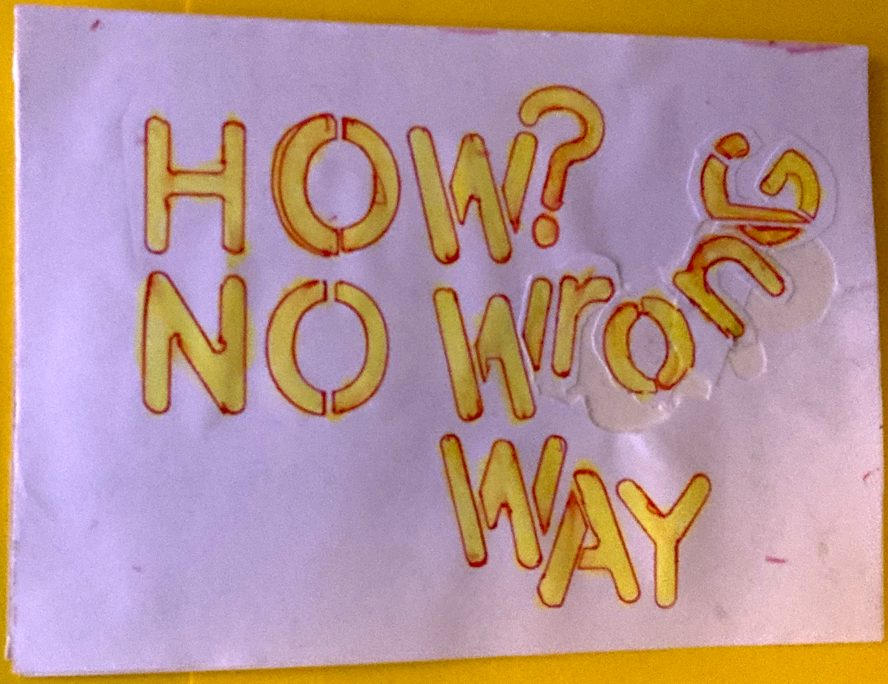

Recovering my childhood's piraty creativity was a ... dirty knife fight ⚔️. And THAT's why I'm giving you my favourite trick. My ace in the hole.

## I'm giving you a gun 🔫 you can take to your own creativity knife fight ⚔️

I recovered my childhood's piraty creativity and one tool I used is an age old and peculiar process I call the Dev Pirate's Pages.

I've done my Dev Pirate's Pages since 2021.
Queen Raae started YEARS before me. And spent considerable time convincing me to do them.

## What are Dev Pirate's Pages?

## How do I do Dev Pirate's Pages?

1. I sit down in my private pirate place with a cup of dark dark coffee.
2. With a fat pile of blank A4 papers in front of me and my fav fountain pen in my hand. I start a timer for 22 minutes.
3. Now I write down EVERYTHING that pops into my head. Literally. For example:

«I slept like dog shaite. Woke up sweaty like a hairy pig, from a bad dream. I was back working on the ship. We were loaded to the gunnels with guests in their summer finery. Toasting tall glasses of champagne. Our skipper was drunk as a skunk and not far away I saw the cops coming in their black and white rubber dinghy. We were F\*\*\*ED.

I guess it's because I'm meeting **(redacted)** tomorrow. F**\*\*\***! I can't BELIEVE she can still get to me, after all these years.»

## Why do I do Dev Pirate's Pages?

It's BAD stuff pouring out, that's the WHY. I write the bad stuff OUT with my Dev Pirate's Pages. That makes it easier to write my creative stuff later on.

## There's no wrong way to do Dev Pirate's Pages

There's no wrong way to do Dev Pirate's Pages. And doing them is not really writing. I'm just getting down WHATEVER, as fast as I can.

Nothing is too weird, weak, angry or stupid, because nobody is EVER reading my Dev Pirate's Pages. Not even ME the first weeks.

## Really?

I know what you're thinking «You call THIS bringing a gun to a knife fight? Give me a BREAK! This isn't even a tool.»

## History speaks for itself

Well I'm not overstating it when I say that this tool has worked for hundreds of recovered artists. Maybe even thousands of recovered artists. Artists like [Tim Ferriss](https://tim.blog/2015/01/15/morning-pages/) And the martial artist Suga Sean O'Mally.

This tool is originally called The Morning Pages. Buy the weirdly beautiful book [The Artist's Way by Julia Cameron](https://www.amazon.com/Artists-Way-Spiritual-Higher-Creativity-ebook/dp/B083X758NX/) and read all about it.

## Since this beloved book came out in 1992..

it's been praised by artists like Martin Scorsese, John Cleese and Reese Witherspoon.
