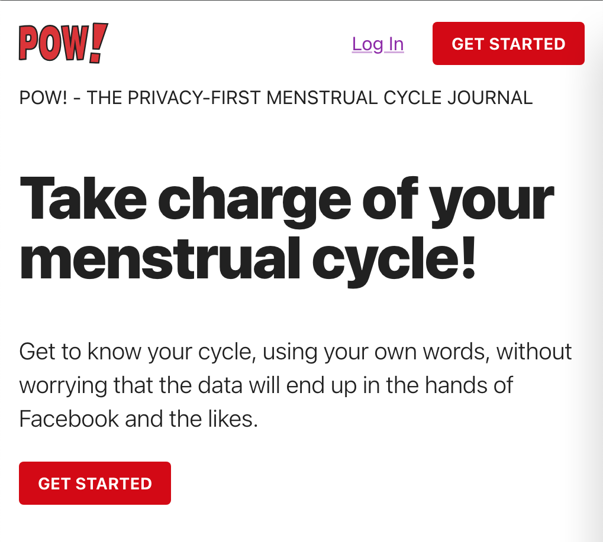
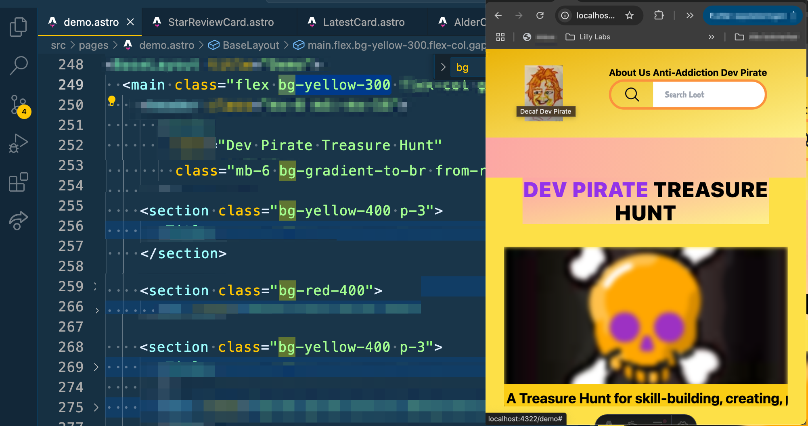
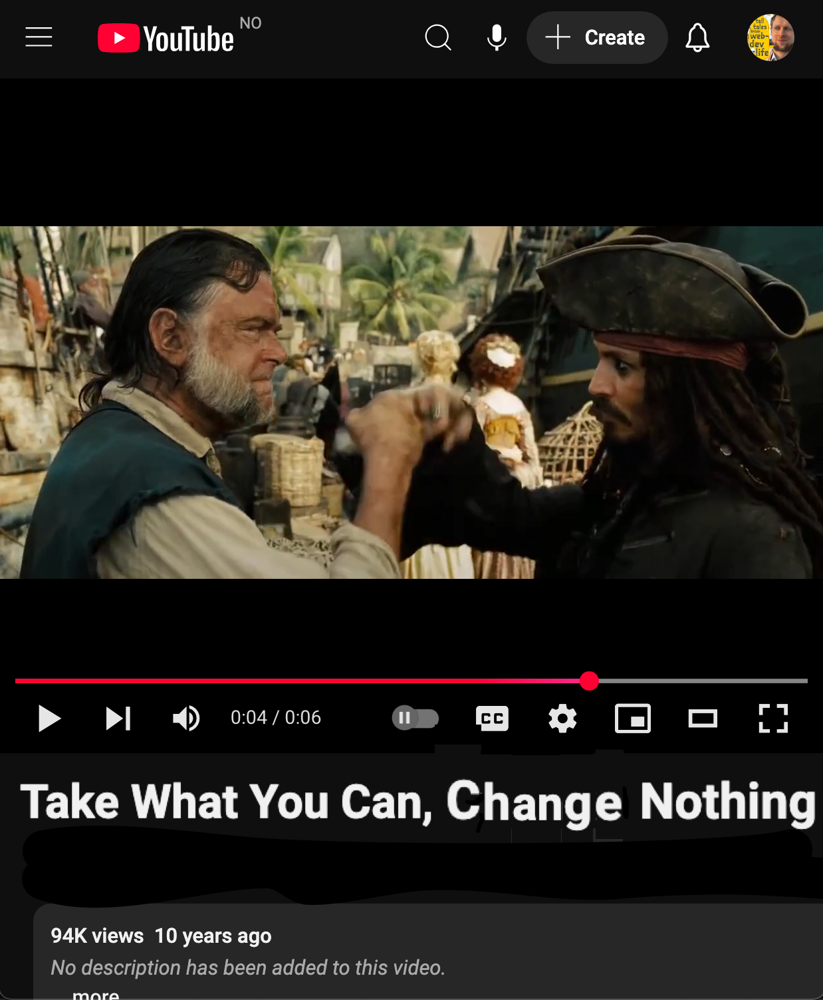
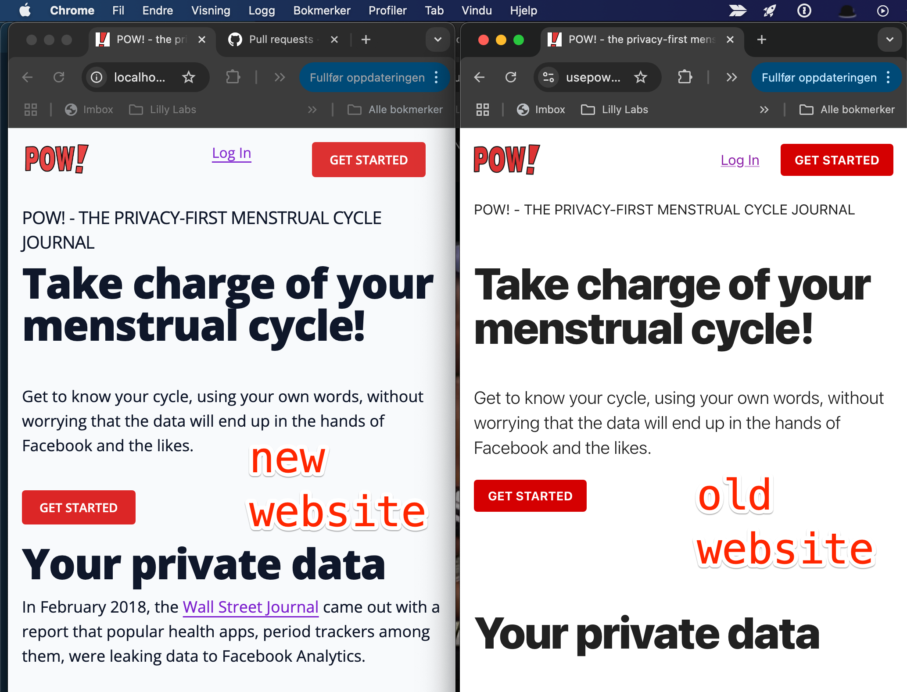
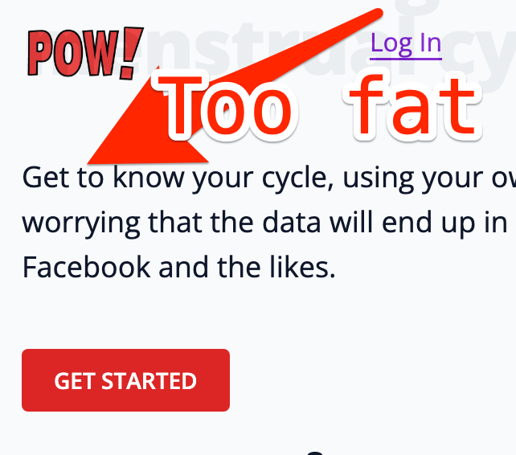
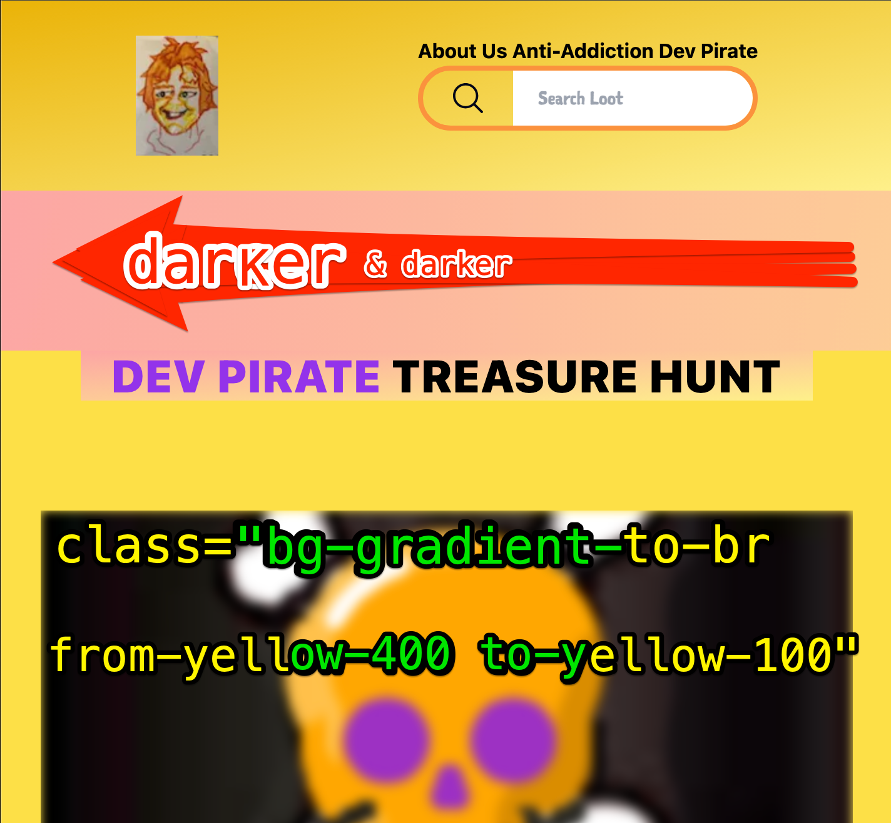

The other day QUEEN [@raae](https://x.com/raae) and I noticed The Pirate Princess (9) likes to know what's going to happen, BEFORE it happens. Since then we've been doing weekly family planning sessions. Last week I had something new for the Pirate Princess:

«You wanna help me migrate our old POW! website?» Captain Ola Said.

## Our POW! website

«YES! What does 'migrate' mean anyway?» Asked the lil' Pirate.

«A good question, I'll show ya! But first, let's play around with background colors in Tailwind.» Captain Ola Said.

«Ok. Let's GOOO!» The Pirate Princess 🏴‍☠️👸 said.

## Playing around with background colors in Tailwind

So I started out letting The Lil' Migrate Pirate (9) play around with the background colors on my blog. Using Tailwind classes. You know, to get into it. We sat together on our orange couch with my laptop. She looked for "bg" in my Visual Studio Code. Then guessed the english spelling of "orange" and "yellow", which where the colors she most frequently chose.

## Now my blog looks like this:

The Pirate Princess (9) loved getting the background colors she wanted. Just like Captain Allister had suggested to me at the gym. She experimented with the shades using numbers.

«So when are you going to tell me what migration is?» The Pirate Princess (9) said.

«Take What You Can, Change Nothing.» Captain Ola Said.

«So migration is the opposite of what I just did?» Said the Pirate Princess.

«Step ONE for a Migrate Pirate is spotting where the new website looks different from the old.» Dev Pirate Ola Said.

«OK, I'm ready for the POW! website.» Said the Pirate Princess.

«Here are the old and the new POW! websites, side by side. You'll tell me where they're different.» Captain Ola Said.

«Those letters are too fat.» The Pirate Princess points at the `
` text.

She's right, but when I change it to `font-light` she says:

«Now the letters are too thin.» Said the Pirate Princess (9).

«I'll fix that later.» Shouted QUEEN [@raae](https://x.com/raae) from the living room where she was drinking wine with our friend Kristin.

«How do you make that yellow go darker and darker like that?» Said The Pirate Princess 🏴‍☠️👸 (9).

«Just copy/paste THAT and chose your color like you're used to.» Dev Pirate Ola Said.

## Chris Sev 🥳🏴‍☠️

Hat tip to the talented and creative [Chris Sev](https://x.com/chris__sev) and his free and breathtakingly beautiful [Beginner Tailwind](https://youtu.be/wEM5NdJ-8HY?si=qQzTAIaOCqtZj-5T&t=5940) [FULL COURSE] on youtube. 9 hours of prime loot.

##

Notes for next part:
«.»

«.»

«.»
Dev Pirate Ola
Captain Ola Said The Pirate Princess 🏴‍☠️👸 (9) said.

Answer to Adam Wathan @adamwathan:
Daughter (9) wanted to help me on a website. So I let her play around with the background colors using Tailwind classes. She looked for "bg" in my code, then guessed the english spelling of "orange" and "yellow". She loved getting the background colors she wanted & watch changes
