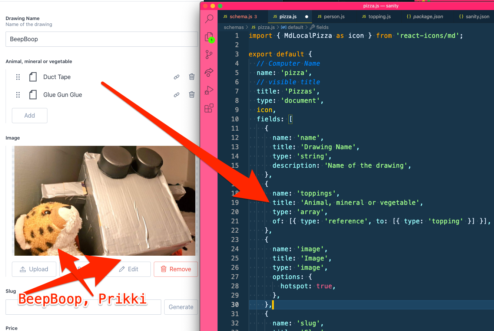

Subject:
Try to create data relationships in Sanity

Ship Ahoy Skill Builder!

## One of my tiny tasks this week was:

– Try to create data relationships in Sanity

## What did I do?

I was working on my personal website. I will be showing photos of Lillian's projects and drawings. And I will be showing photos of my own projects and drawings

I tried to make a way to show what animals, minerals or vegetables are in Lillian's projects and drawings. By creating data relationships in Sanity.

## Why did I do it?

Why is adding Lillian's projects and drawings to my website making my skill building better?

First, let's look for some facts.

### Fact searching questions

1. Is making Lillian smile important to me?
2. Does Lillian (6 🏴‍☠️👸 ) draw many drawings and do many projects?
3. Will getting Lillian's projects and drawings onto my live website make Lillian smile?
4. Do I need to build my Sanity skill to get Lillian's projects and drawings onto my website?

### Factual answers

1. Yes.
2. Yes.
3. Yes.
4. Yes.

### Conclusion

So, what's your opinion? Will I be less or more mindfull while building my Sanity skill if I need that skill to get Lillian's projects and drawings onto my website?

## How did I do it?

**The Steps**

1. I opened my Master Gatsby notebook and found the page 13 called "data"
2. I opened my Sanity code in VS Code
3. I opened schemas / pizza.js
4. I deleted the code I guessed was the code from "Creating data relationships", video 13 of Master Gatsby by The Great and Powerful Wes Bos.
5. I set my timer for 1 hour and 36 minutes and 33 seconds.
6. I re-coded the code while looking in my notebook.
7. I ran the code and looked at http://localhost:3333/desk/topping
8. I changed the code to make it show what animals, minerals or vegetables are in Lillian's projects and drawings.

```js
//sanity / schemas / pizza.js

export default {
  // Computer Name
  name: 'project',
  // visible title
  title: 'Project',
  type: 'document',
  icon,
  fields: [
    {
      name: 'name',
      title: 'Project Name',
      type: 'string',
      description: 'Name of the project',
    },
    {
      name: 'toppings',
      title: 'Animal, mineral or vegetable',
      type: 'array',
      of: [{ type: 'reference', to: [{ type: 'topping' }] }],
    },

```

9. I ran the code and looked at http://localhost:3333/desk/topping



10. I repeated 8.
11. I repeated 8.
12. I repeated 8.
13. I repeated 8.
14. I repeated 8.
15. I was done.

My useful beliefs are useful to my skill building.

Try creating a useful skill building belief for yourself. 🔧😺👍

Keep your skill-building-submarine afloat this week!
🔧⛵🏴‍☠️

Ola Vea
Gatsby Piraty Captain

P.S.

## One of your tiny tasks this week can be:
