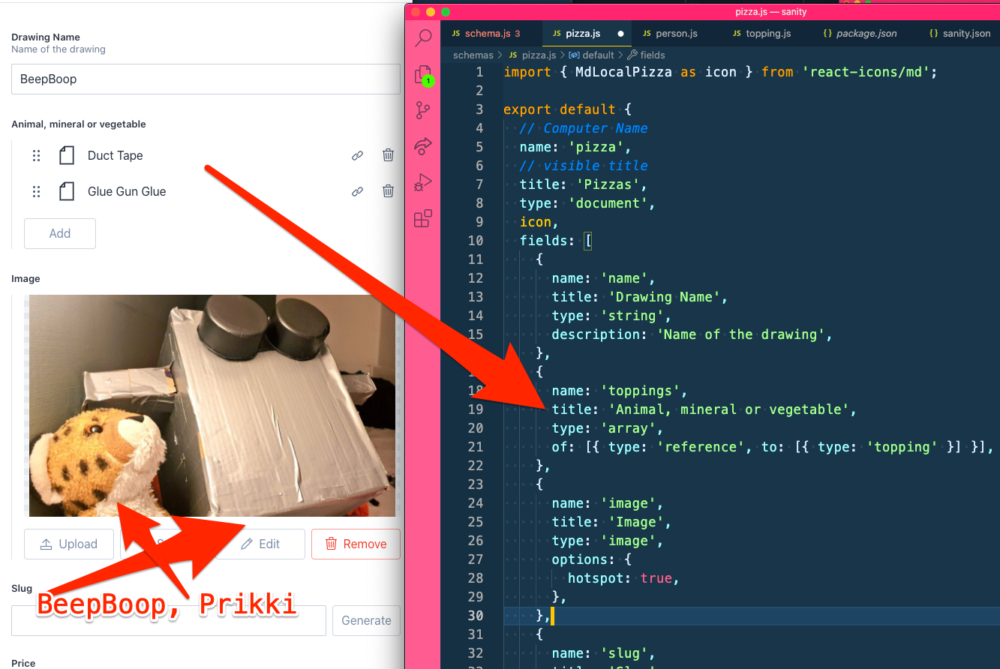

Subject:
Try \_ \_ \_ \_ \_ in Sanity

Ship Ahoy Skill Builder!

## One of my tiny tasks this week was:

– Try dsg with the

## What did I do?

I tried DSG in a new Gatsby site using the hello-world starter

## Why did I do it?

## How did I do it?

**The Steps**

1. I opened my \_ \_ \_ \_ notebook and found the DSG page
2. I opened my terminal npx gatsby new gatsby-starter-rendering-modes https://github.com/gatsbyjs/gatsby-starter-rendering-modes

3. cd gatsby-starter-rendering-modes/
4. npm start
5. I opened gatsby-node.js in VS Code
6. I deleted the code

7. I set my timer for 1 hour and 36 minutes and 33 seconds.
8. I re-coded the code while looking in my notebook.
9. I ran the code and looked at http://localhost:8000/desk/topping

```js
// gatsby-node.js
const path = require("path");

exports.createPages = ({ actions }) => {
  actions.createPage({
    path: "/dsg", // expected relative path
    component: path.resolve("src/templates/dsg.js"), // this path goes to where the defered page should be expected
    defer: true,
  });
};
```

8. I changed the code to make it \_ \_ \_ \_ \_

I guessed was the code from "Creating data relationships", video 13 of Master Gatsby by The Great and Powerful Wes Bos.

```js
//sanity / schemas / pizza.js

export default {
  // Computer Name
  name: 'project',
  // visible title
  title: 'Project',
  type: 'document',
  icon,
  fields: [
    {
      name: 'name',
      title: 'Project Name',
      type: 'string',
      description: 'Name of the project',
    },
    {
      name: 'toppings',
      title: 'Animal, mineral or vegetable',
      type: 'array',
      of: [{ type: 'reference', to: [{ type: 'topping' }] }],
    },

```

9. I ran the code and looked at http://localhost:3333/desk/topping



10. I repeated 8.
11. I repeated 8.
12. I repeated 8.
13. I repeated 8.
14. I repeated 8.
15. I was done.

My useful beliefs are useful to my skill building.

Try creating a useful skill building belief for yourself. 🔧😺👍

Keep your skill-building-submarine afloat this week!
🔧⛵🏴‍☠️

Ola Vea
Gatsby Piraty Captain

P.S.

## One of your tiny tasks this week can be:
