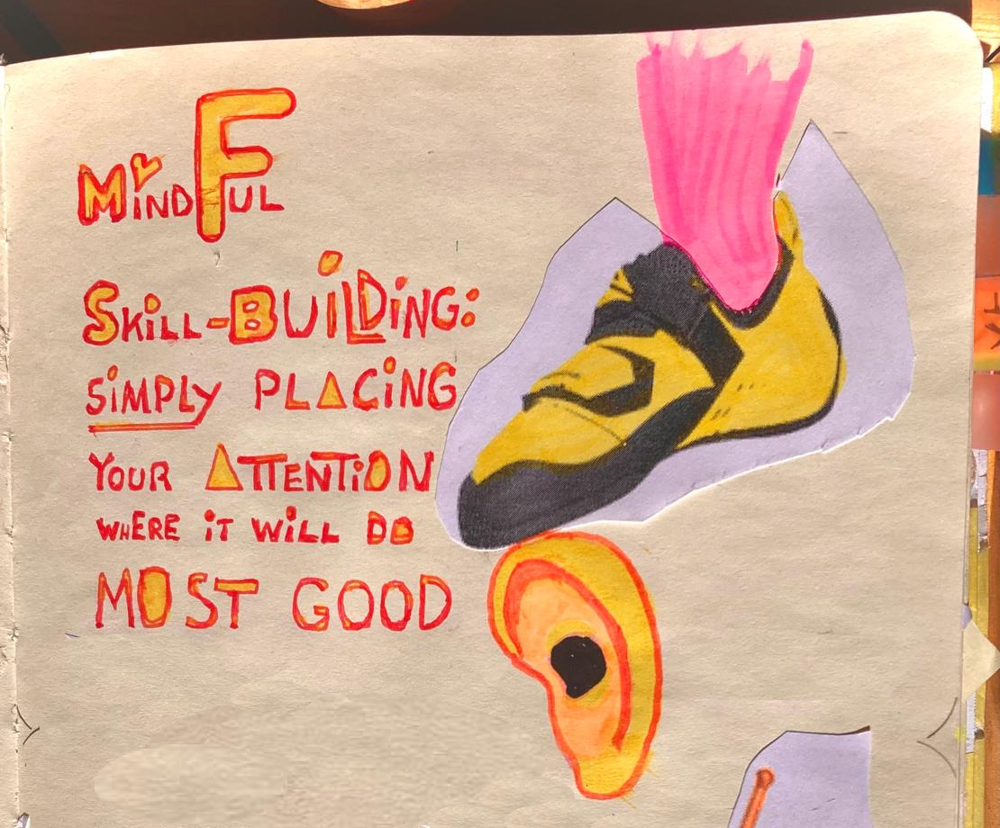

On the Bus to the Climbing hall I told The Pirate Princess about "Five Step For Footwork"

I only remembered 3 steps though…

1. Pick a route you’ve ALREADY mastered
2.  Look at your foot,
        1.  move it slow
        2.  place it precisely
        3.  on the thing
        4.  and to the wall at the same time
3. Pretend it’s NEWLY painted. Smudge as little as possible

“I’ll NOT do that!” The Pirate Princess (10) said.

I guess that’s NOT a win then. 😹

P.S.
"Five Step For Footwork"
is based on Sara "Send Edition" Wade's video [Sara "Send Edition" Wade's video ](https://t.co/bmyZyf7Mmf)