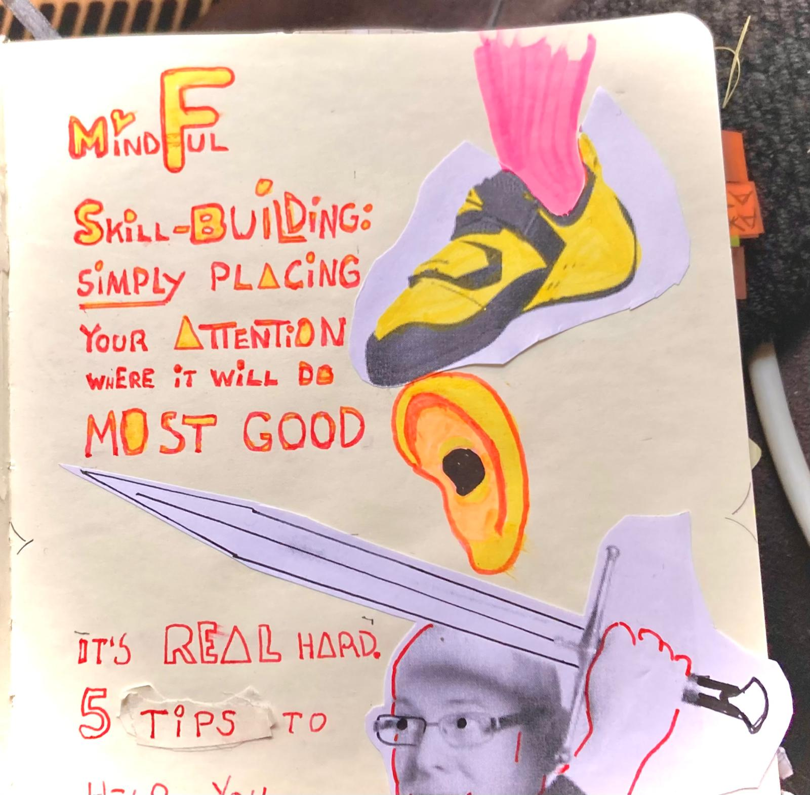

## A Guide to Mindful Skill-building in Five Steps

Mindful Skill-building is simply placing your attention where it will do most good. But it's really, really hard. According to [Guy Windsor](https://swordschool.shop/pages/about), a respected sword trainer irl and one of the internet's most decent dudes.

## Practicing my Mindfullness while Climbing

For me, a great way to practice mindfulness is indoor rock climbing. I practice mindfulness by placing my foot slowly and precisely on the foothold. Let's look at Dr. Guy Windsor's five tips an see how many I can use while practicing my rock climbing mindfulness.  

## Dr. Guy Windsor's five tips for Mindful Skill-building 

1. If you're not building ONE skill, you're not mindful. Multitasking is mindless.
2. If your practice is not demanding absoulute limit of your concentration and skill, you're not mindful.
3. If your practice is not generating measurable improvements, you're not mindful.
4. If your practice is not tiring, frustrating and painful, you're not mindful.
5. If your practice highlights your EVERY weakness and helps you stengthen your skill efficently and deeply, then it is, must be mindful.

## Let's see how I did while practicing my rock climbing mindfulness  

Dr. Guy Windsor's five tips:

1. ✅ I'm building ONE skill 
2. ✅ I was at my absoulute limit of my concentration and skill 
3. ✅ I did generate measurable improvements 
4. ✅ My practice was tiring, frustrating and painful
5. Not sure if my practice highlighted my EVERY weakness and helped me stengthen my skill efficently and deeply

So that's FOUR out of five, not shabby, not shabby at all!

This is part of my coming book:

# The Mindful Skillbuilder

## A Dev-Dad's lurid Logbook

### Or a Treasure Hunt of Excessive Experiments and Badass Book Blurbs

Today's text was inspired by [Doctor Guy Windsor](https://swordschool.shop/pages/about) and [the footwork part of Sara "Send Edition" Wade's video](https://t.co/bmyZyf7Mmf)

