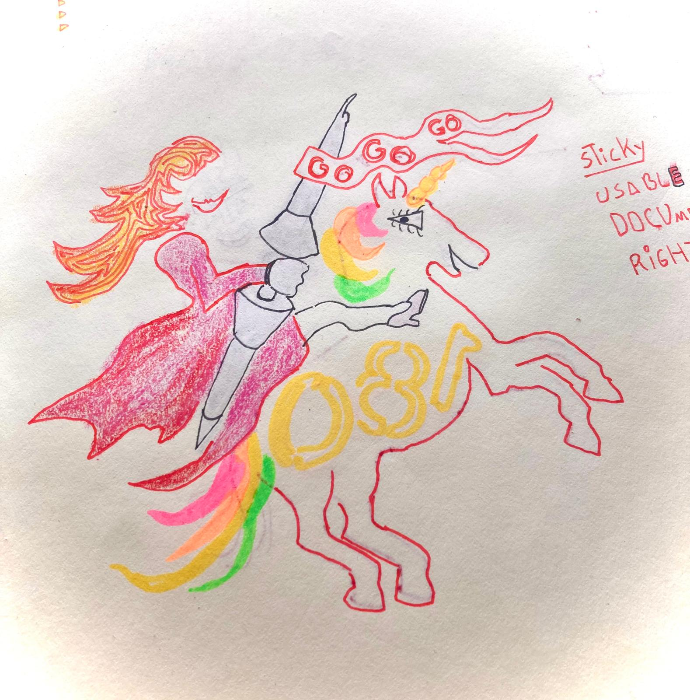

## We're looking for 5 low-code builders to talk to about customer portal challenges 

We want to better understand their current processes and pain points. We've take a page out of ...'s book Deploy Empathy. Literally. I'll be using her interview script.

## But who should I interview?

I've been looking around on reddit and in the webflow forum
Who cares! Let's Go Go Go!

Hi!

Thanks for your interest in talking to me about showing your users only the data you want them to see.

I’d love to hear about your experiences and your process.

Queen Raae tells me:

You’re creating 
...
for your clients. Where they can login to see ...

You use ... and ...

Challenges:
3. It's hard to 

I’ll soon send you a link to book a time.

Ahoy!

Captain Ola
