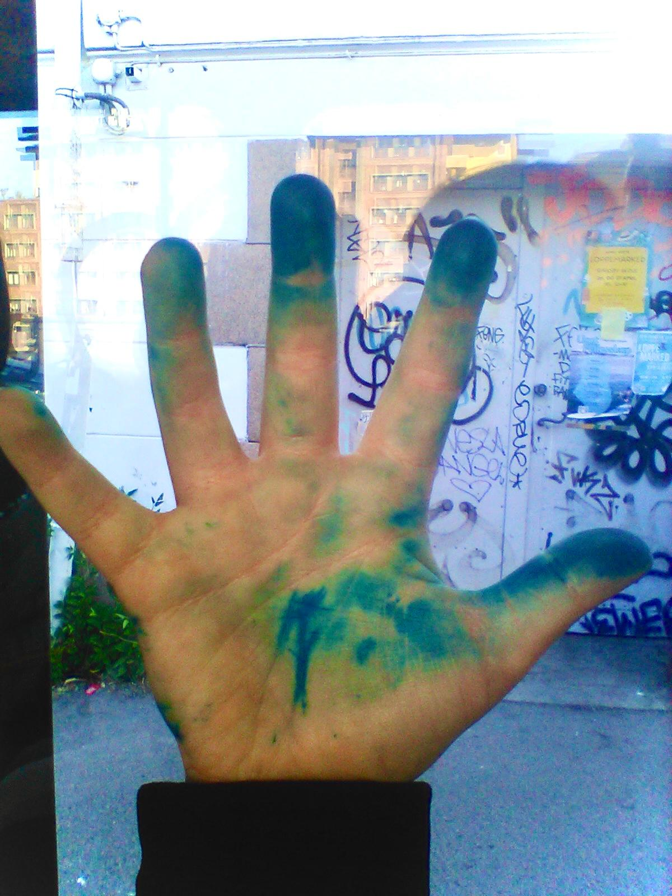

Lillian (10) dreamt she killed the smurf King, and woke up like this:

## What Actually Happened

What Actually happened was that Captain Allister came by with an important document for us to sign. So I brought out my second best fountain pen and the blue ink bottle made of glass. I signed the important document. Queen Raae signed the important document. We chatted about our upcoming 11-week-sailing trip. THEN The Pirate Princess (10) came home from school, gave Captain Allister a big hug and said "Can I sign the document?"

"No you can NOT sign the document, because you have to be 18." I said. We chatted about who would live in what part of the boat during the 11-week-sailing trip. Then Lillian (10) said "Pleeeaaase let me sign the document."

I said "No, you're still not 18." 

"Are your fingers blue from the ink in that pen?" Lillian Asked me. 

"Yes, do you wanna try it? Go get yourself some pieces of paper." I said.

We chatted some more about this summer's 11-week-sailing trip and Lillian (10 👸🏴‍☠️) was careful about not showing Captain Allister how anxious she is about it. And how she hopes to just skip the whole thing. Because she thinks the world of Captain Allister and this trip is his big dream.

## Bedtime Percy Jackson #1 Reading

Later that night I was reading Percy Jackson #1 for Lillian (10) in bed. I could tell she was dreading the trip, but not keen on talking about it. So I asked her "Do you wanna try my blue pen again?"

"No... No, not really." Lillian (10) said and sounded down. 

I read a little more for her.

## Changing Her Mind

"Actually, let me use your blue pen." Lillian (10) said.

"Sure." I said and went and got the blue fountain pen.

"It's not working now." She sounded down again. 

"Ok, do you wanna refill it from the glass bottle?" I asked her.

"No, you refill it." Lillian said still sounding down.

I came back with the refilled pen and said "Be careful to not get the ink on your duvet now, ok?"

"Yes I'll be careful." She said.

I read almost a whole chapter of Perrcy Jackson while she was busy drawing in her big lined notebook. She was drawing ...

"Wow! Look at my hand!" Smiling brightly she showed me her hand, every finger was blue. one finger was almost black

"Look at that! Good thing it didn't come on your duvet." I said smiling.

"I did get a small spot on my duvet, but that's alright." Lillian (10 👸🏴‍☠️) said.

"You'll have to wash your hand berfore falling asleep." I said

"Yes." She was smiling looking at her fingers.

## The Next Morning

The next morning her fingers were still blue, even after washing them again.

"What tale are you going to tell your teacher about how your hand got that way?" I asked her.

"I'll tell my teacher I dreamt I killed the smurf King, and woke up like this." Lillian (10) said.

Photo taken by  Lillian (10) with her Nokia banana phone. The Nokia 8110. 