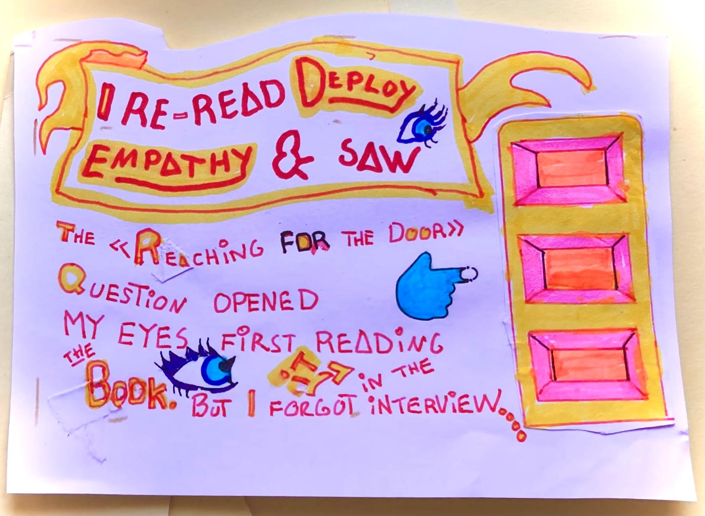

We've all been there – that moment when you realize you forgot something right after it's too late to fix it. This feeling hits especially hard when you discover you forgot THE MOST important question in your interview toolkit.

If you're building a product and haven't started talking to users yet, this story might save you from making the same mistake I did. 

Here's what happened when I conducted my very first user interview for Galleon Tools – and why forgetting one simple question taught me more about user research than any textbook ever could.

I did my first user interview for Galleon ⛵🥳

I interviewed a visual developer, a potential Galleon ⛵ user. I did it to learn about how she is building a customer portal and learn about her process, problems
and what tools she's using

Before the interview I printed out [@mjwhansen's](https://x.com/mjwhansen) "Customer Discovery Script" template. 

But if like me you haven't done a user interview yet, you'll be interested to know that it's normal for interviewees to save up their most crucial info for the last moment.

## Yeah, I didn't think about THAT! 

I didn't think about that before two days later, when I was re-reading [Deploy Empathy](https://deployempathy.com/). A book written by [@mjwhansen's](https://x.com/mjwhansen). I saw the "Reaching For The Door" question again .... I was like "NOW I remember how the "Reaching For The Door" question opened my eyes when I first read the book.

A quote about what the reaching for the Door" question  is

I Re-read Deploy Empathy and made this sketchNote in the breaks between helping out with the practice at Lillian's (10) cirkus practice. They'll have their big show soon.

Read more about the "Reaching For The Door" question in this blo-po.

