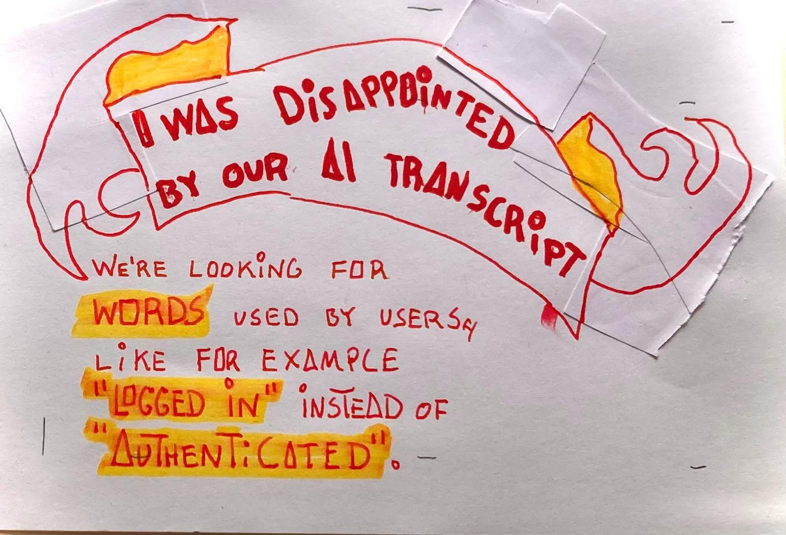
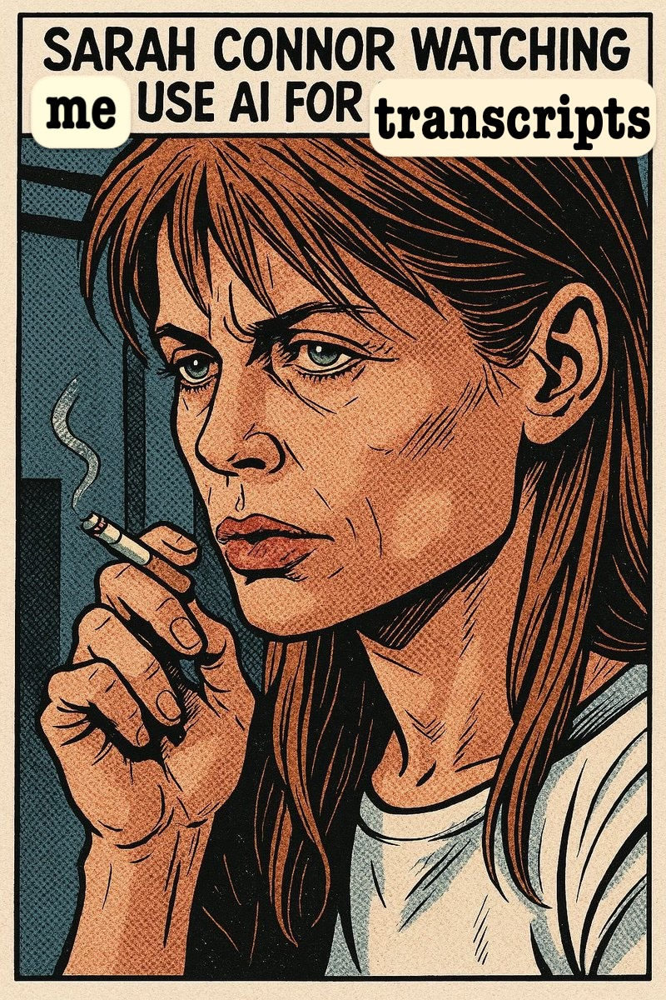

When we're doing user interviews we're looking for words used by users, like for example "logged in" instead of "authenticated".

So that our docs can be clearer and easier to use for our potential customers.

But when I started reading the gemini-transcript of my second user interview I had to stopped. I stopped reading, stood up and had to take a walk around our home office.

Queen Raae asked me "Are you okay?"

"What? No, I'm NOT okay. This AI-transcript is not word-for-word. It's some sort of AI-mumbo-jumbo summary. SOME of the words are the same... I'm Disappointed."

The fact was that I felt sorry for myself. I knew there were some golden nuggets in the user interviews we've done. And my notes were incomplete.

This AI-mumbo-jumbo summary was not what we wanted because we want the wording used by users, we want to know the actual words they're using.

I walked off my the blackest part of my anger and self pity. I made a REAL strong cup of coffe and went back to work on Galleon.

Two days later I forced myself to look at the transcript again to warm up for that day's user interview..

And then when I was reading it, I noticed the sidebar in the Google doc. The first tab said "notes" the seecond tab said "transcript". I was reading the "notes" tab. I clicked on the "transcript" tab and I was like, oh, okay. HERE is the
word-for-word transcript.

