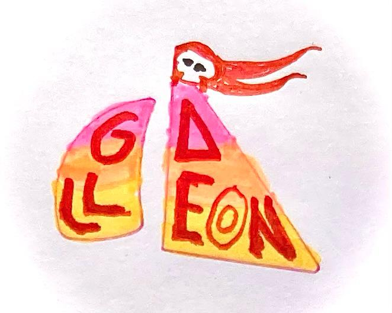

When we're doing user interviews, we hunt for the exact words our users say. When someone mentions being "logged in" instead of "authenticated," that's gold—it tells us how to write clearer documentation that actually connects with our customers.

But when I started reading the gemini-transcript of my second user interview I had to stop. I stopped reading, stood up and had to take a walk around our home office.

Queen Raae asked me "Are you okay?"

"What? No, I'm NOT okay. This AI-transcript is not word-for-word. It's some sort of AI-mumbo-jumbo summary. SOME of the words are the same... I'm Disappointed."

The fact was that I felt sorry for myself. I knew there were some golden treasures in the user interviews we've done, but my notes were incomplete.

This AI-summary was not helping me find the actual words they're using.

I walked off my the blackest part of my self pity, made a REAL strong cup of coffe and went back to work on Galleon.

Two days later I forced myself to look at the transcript again to warm up for that day's user interview..

And then when I was reading it, I noticed the sidebar in the Google doc. The first tab said "notes" the seecond tab said "transcript". I was reading the "notes" tab. I clicked on the "transcript" tab and I was like, oh, okay. HERE is the
word-for-word transcript. Smiling I kept on reading hunting for treasure.

