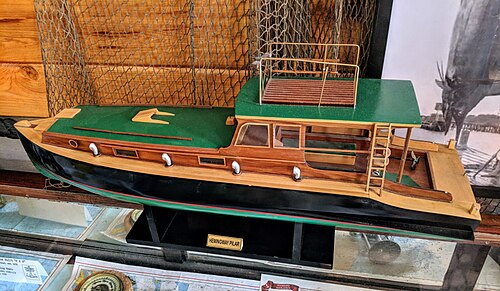

Bad mistake! My wife told me repeatedly "Stop reading!" several nights. "Stop reading, you need to sleep. You'll get cranky tomorrow."

So what's the problem with Islands in the Stream? It starts out calmly enough with an American painter who finds tranquility on the island of Bimini, in the Bahamas. He hangs out with friends and works. But soon his three sons arrive and they get into a dramatic situation while snorkling. The American painter is nearby watching from his deep sea fishing boat.  

## That Sets the Unsafe Tone 

I knew he'd get back on that deep sea fishing boat and I knew stuff would get dangerous. Have you ever read a book where you feel safe? "There WILL be a happy ending, don't worry" knda book. Well I realised this was no longer one of those safe books. 

In part two World War 2 has been going on for a while and the American painter has stopped painting. He's skippering his deep sea fishing boat. Hunting german U-boats with a motley crew. Some guys like henry, Ara and Antonio are solid. But Willie and Fredricks are NOT solid. They all go out in bad weather to hunt down a crew of germans who have had their U-boat sunk. 

The way Ernest Hemingway pases the story is evil. I'm not going to give you any spoliers, but he's letting them find clues. Unsubtle clues that their getting closer and closer to a REAL hairy situation.

## I Had to Start Reading Another Book at Night

I love a tight, fast paced story. It's my favourite tale actually, but this was a bit strong. So I bought [Islands in the Stream as an audiobook](https://www.audible.com/pd/Islands-in-the-Stream-Audiobook/B002V1OA2A) and listened in the day time.