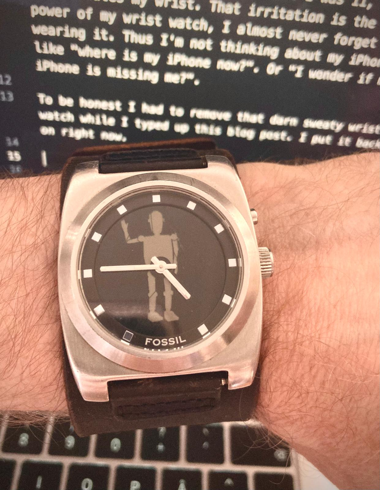

I started wearing a wrist watch to remind me to leave my iPhone in the lurch.

The obvious thing is "what time is it?" and I'm not pulling out my iPhone. But much more powerful is leaving my iPhone in another room than my work room. Google the research for yourself. Participants in the research persist longer during hard tasks if their iPhone is left in another room than those who have their iPhone in the same room, but out of site.

I haven't worn a wrist watch since I was 11, because it irritates my wrist. That irritation is the super power of my wrist watch, I almost never forget I'm wearing it. Thus I'm not thinking about my iPhone, like "where is my iPhone now?". Or "I wonder if my iPhone is missing me?".

To be honest I had to remove that darn sweaty wrist watch while I typed up this blog post. I put it back on right now.

Look here is proof, my wrist watch is waving at you:

