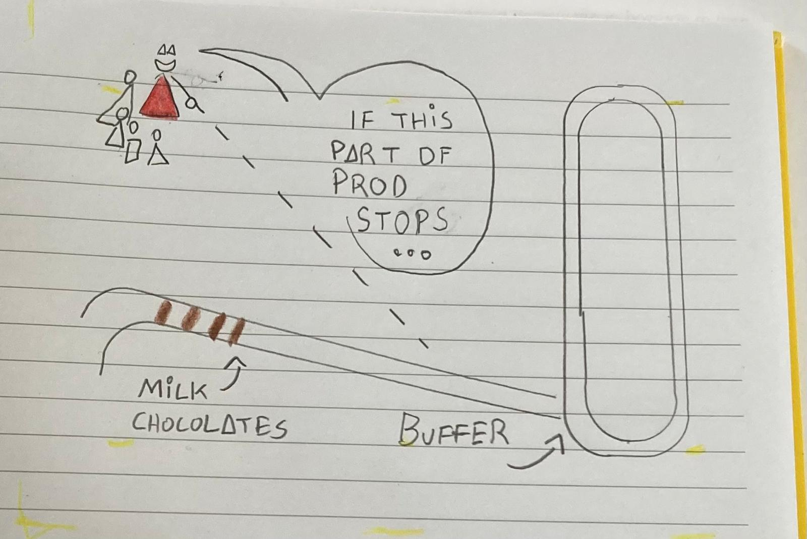

## 

**What:** We went to our local chocolate factory

**What for:** FUN and production learning

**Who for:** Viking-Lillian (10) and four grown up chocolate fans 

**How to:** 

Freia Wonka gave us a tour of our local chocolate factory. Before entering the actual production we had to lock up our phones. But i made sketchnote

"If this first part of our production stops ..." Said Freia Wonka.

illu

"Then the next part of production "eats" into the buffered milk chocolates and keeps chugging along. While we furiously find and fix the bug. Which is usually just a tiny bit of something stuck in our machinery somewhere."

Said Freia Wonka.

