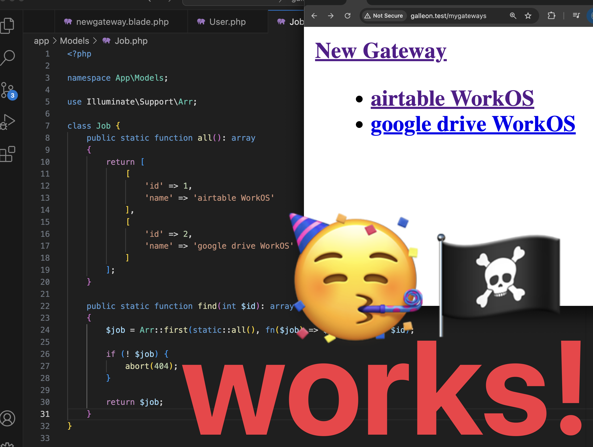

## It Works!

**What:** I made a Gateway class inside the App\Models\Job; namespace

**What for:** 
**Who for:** 

**How to:** 





```
class Gateway {
    public static function all(): array
    {
        return [
            [ 
                'name' => 'airtable WorkOS'   
            ],
            [
                'name' => 'google drive WorkOS'   
            ]

        ]
    };
}
```