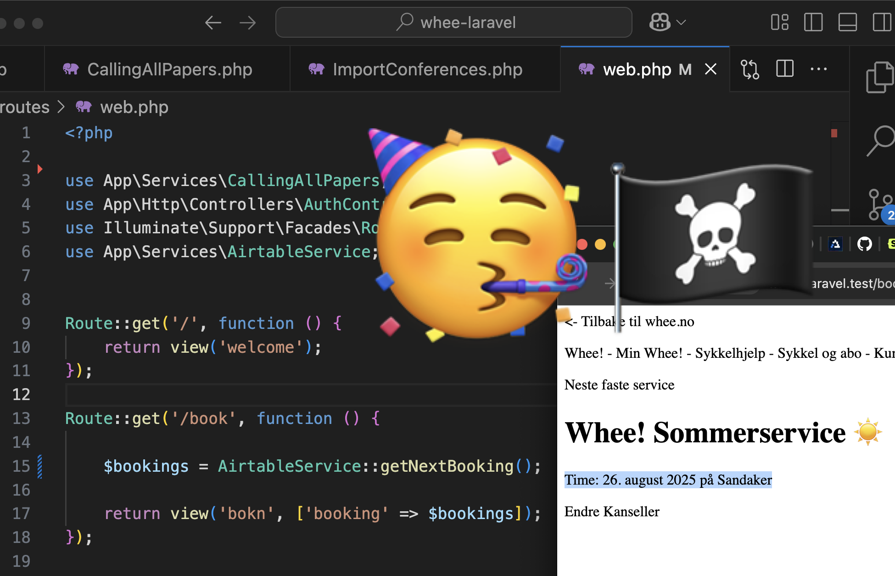

I started with the text below from the github squash merge, but I wanted to refine the text for my own Laravel skill-building, so ideas for writing-TODOs are:

- [ ] Look through paper notes and index cards and SketchNotes and printed out code and bullet journal
- [ ] Look through my 7 half written blog-posts from August
- [ ] Look through my 6 half written blog-posts from July
- [ ] Look through my 3 half written blog-posts from June
- [x] Look through commits on github
- [x] Look through comments from Queen @raae on github
- [ ] Look through comments from Queen @raae on Slack
- [ ] Look through tweets from Queen @raae 
- [ ] Look through Queen @raae 's Bluesky
- [ ] Look through tweets from me
- [ ] Look through my Bluesky
- [ ] Write ideas


**Output**

- [ ] Make some sketchNotes
- [ ] Collect Tiny-Tasks for Practice and Repetition
- [ ] Collect and organize index cards in The Yellow Chocolate Factory Inventor Book
- [ ] Shoot one youtube short
- [ ] Write One blog-post


Summing up booking on Whee 🚴‍♀️ #136

* notes [commit](https://github.com/raae/whee-laravel/pull/3/commits/3c084bee1d475f9f13b2a9e72bb71dd2a098025e) 

* Created a new view 'booking' and a new route '/booking'  [commit](https://github.com/raae/whee-laravel/pull/3/commits/962dd552d1f970fd1aa888ee80cb6a98f58536d7)

* added an array of dummy data to routes [commit](https://github.com/raae/whee-laravel/pull/3/commits/ca5f92416c289c32fe25de853c4b75c2c5d87edd)

```php
// Practice Rou::ge();
// Rou::ge('/ice', fun () {
//     re view('ice', [
//         '🤡' => ['time' => '26. august 2025', 'location' => 'Sandaker']
//     ]);
// });

Route::get('/practice', function () {
    return view('practice', [
        'dummyAirtableArray' => ['time' => '26. august 2025', 'location' => 'Sandaker']
    ]);
});
```

* created a dynamic route and moved the booking route to the bottom of web.php and display the dummy data in '/booking/{id}' [commit](https://github.com/raae/whee-laravel/pull/3/commits/989c3d6b3e832dff15e0b86175e42fa3217d0a85)


Comment from Queen @raae on github


Veldig bra med booking side. Trenger kun booking, ikke booking med id da vi kun skal vise frem kundens siste booking.

Jeg foreslår du hardkoder en booking i en funksjon som heter getNextBooking in AirtableService filen. Så kaller du på den i web.php og sender til viewet booking. Det vil si at det ikke trengs noen command eller ny service.

Senere kan du se på det jeg gjør med å vise frem kundens sykkel, og gjøre det likt.

* Step 6 starting on the api call with a simple api about conferences that has 'time' and 'location' in the data [commit](https://github.com/raae/whee-laravel/pull/3/commits/fa5a92ff9ee30421a63128d64ee8294ff6d3ef6f)

* php artisan make:command ImportConferences [commit](https://github.com/raae/whee-laravel/pull/3/commits/08b62edb8b3921d424cc63a9e5cdc3f09b6d9a81)

* 'cfps:import' [commit](https://github.com/raae/whee-laravel/pull/3/commits/36396a87fac34ec93ca8f0497be8ab1db29451b6)

* php artisan cfps:import gives me Target class [App\Console\Commands\CallingAllPapers] does not exist [commit](https://github.com/raae/whee-laravel/pull/3/commits/c8516df3505274a319e3351d7adcb4e5d6a381c2)

* 🥳 Iiiiit woooorks! 🥳🏴‍☠️ [commit](https://github.com/raae/whee-laravel/pull/3/commits/38784b372a3f9d3c682e32388ec60d4977ec79df)

* Created a class that says for a conference with a unique id, the 'cfp_uri' import it and dd() the 'cfp_uri' [commit](https://github.com/raae/whee-laravel/pull/3/commits/02b6c111d195e29d42d63b9e230de3ece2727e12)

* Deleted my first try on the CallingAllPapers class [commit](https://github.com/raae/whee-laravel/pull/3/commits/b68f7f42a9764ba44045aa93ed04596b77f2c875)

* 'dateEventStart' and 'locatio' from the api [commit](https://github.com/raae/whee-laravel/pull/3/commits/e0a0e6593bf2ae09406e89548ef42b1eae5890a0)

* found location in the conference api [commit](https://github.com/raae/whee-laravel/pull/3/commits/9aecb19d1e3be64fa7fd430c9aeb9ee05cf035af)

* Can I use CallingAllPapers in routes > web.php? [commit](https://github.com/raae/whee-laravel/pull/3/commits/7c76c5b85058cbd29f2c4b3667b64027dcfe6fa2)

* Now GetNextBooking works in the router 🥳 [commit](https://github.com/raae/whee-laravel/pull/3/commits/591a114c80ffd39df757f84637ce9f5d65800c5c)

```php
// web.php
class GetNextBooking
{
    public static function all(): array
    {
        return ['time' => '26. august 2025', 'location' => 'Sandaker'];
    }
}

Route::get('/bokn', function () {
    return view('bokn', ['booking' => GetNextBooking::all()]);
});
```

* I didn't get around to passing this on to web.php [commit](https://github.com/raae/whee-laravel/pull/3/commits/1ba427353566dfbae46da09bb271529523ed341b)

* Internal Server Error Call to a member function getNextBooking() on string [commit](https://github.com/raae/whee-laravel/pull/3/commits/0836f393bce8581b7c8013d6dfa69c2d3d9effde)

* iiiiit wooooorks! 🥳🏴‍☠️ [commit](https://github.com/raae/whee-laravel/pull/3/commits/515bb10654142241bd587964f716f378bca90cc0)

```php
$bookings = AirtableService::getNextBooking();
```



```php
// web.php
Route::get('/book', function () {

    $bookings = AirtableService::getNextBooking();

    return view('bokn', ['booking' => $bookings]);
});

// app/Services/AirtableService.php
    public static function getNextBooking ()
    {
        return ['time' => '26. august 2025', 'location' => 'Sandaker'];        
    }
```
Comment from Queen @raae on github

Veldig bra, nå vis frem kun én booking i dashboard. Altså hardkode en booking, ikke en liste av bookings og send den inn til view dashboard og så vis den frem der. Bonus, lenke til den bookingens side på booking/{id} som allerede fungerer.

Bra gjort med  `AirtableService::getNextBooking`. 

For å fullføre:
- [x] Rydd opp, dvs. fjerne `booking/{id}` og `bokn/{id}`
- [x] Flytt `/book` under auth på samme måte som `/dashboard` sånn at kun innloggede får tilgang til å endre
- [x] Flytte booking info i dashboardet under account info, trenger ikke style


Comment from Queen @raae on github

Slett command og call all papers service så er den good to go!


* hardcoded ONE 🚴‍♀️ booking, [commit](https://github.com/raae/whee-laravel/pull/3/commits/9cb75bf22aa88f512408bc9eb3c25e2c89a506e5)
in web.php and
sendt it in to  view > dashboard.blade.php and
showed it there

Bonus, link to the change  🚴‍♀️ bookings page at /book 
which already works


* hardkodet en booking,
i web.php og
sendte den inn til view dashboard og
så vis den frem der.

Bonus, lenke til den bookingens side på /book som allerede fungerer.
@[olavea](https://github.com/olavea) olavea [force-pushed](https://github.com/raae/whee-laravel/compare/224bd281dc767f632d44bd1d77f192ea5882b2b6..9cb75bf22aa88f512408bc9eb3c25e2c89a506e5) the booking branch from [224bd28](https://github.com/raae/whee-laravel/commit/224bd281dc767f632d44bd1d77f192ea5882b2b6) to [9cb75bf](https://github.com/raae/whee-laravel/commit/9cb75bf22aa88f512408bc9eb3c25e2c89a506e5) 
[2 days ago](https://github.com/raae/whee-laravel/pull/3#event-19153742768)

* Moved down service (and added som tailwind styling for fun  🥳) [commit](https://github.com/raae/whee-laravel/pull/3/commits/98de804dbba8fe030b597be2ef96d2e2fb6c63c5)

Add code

* So, we don't need the hardcoded service times in web.php anymore [commit](https://github.com/raae/whee-laravel/pull/3/commits/c74e9ec9ee576faea330ab3d5ee36fe5106e1b66)

* Moved /book under auth so that only logged in users get access and can change service times [commit](https://github.com/raae/whee-laravel/pull/3/commits/7c1feef08d5c4fc482090048e49e1d5513069537)


```php
// web.php
Route::middleware('auth')->group(function () {
    Route::get('/book', function () {

        $bookings = AirtableService::getNextBooking();

        return view('bokn', ['booking' => $bookings]);
    });
});
```

* Deleted  booking/{id} and bokn/{id} [commit](https://github.com/raae/whee-laravel/pull/3/commits/627fa5769f3e5c46fcb67db8fcab990f1acd6e53)

* Queen Raae did a Small cleanup [commit](https://github.com/raae/whee-laravel/pull/3/commits/32c27ec1959c646301a1db6a7359bf68ed99733c)

```php
        <div class="mb-6">
        <div class="space-y-2">

        // why " and not '?
                                    {{ $booking["time"] }}
                                    på {{ $booking["location"] }}                                    
        // what is &nbsp;|&nbsp; ? just a  |    between                           
                        <a href="/booking" class="text-sm text-gray-600">
                            Endre tid
                        </a>
                        &nbsp;|&nbsp;
                        <a href="/booking" class="text-sm text-gray-600">
                            Kanseller
                        </a>                           
        </div>
// web.php        
// Protected routes

Route::middleware('auth')->group(function () {
    Route::get('/min-side', function () {
        $booking = AirtableService::getNextBooking();
        return view('dashboard', ['booking' => $booking]);
    })->name('dashboard');

    Route::get('/booking', function () {
        $booking = AirtableService::getNextBooking();
        return view('booking', ['booking' => $booking]);
    })->name('booking');
});        
```
* Deleted command og callAllPapers service [commit](https://github.com/raae/whee-laravel/pull/3/commits/eea334a183d51bf4b0c805638cc52348196724ac)

---------

Co-authored-by: raae <queen@raae.codes>