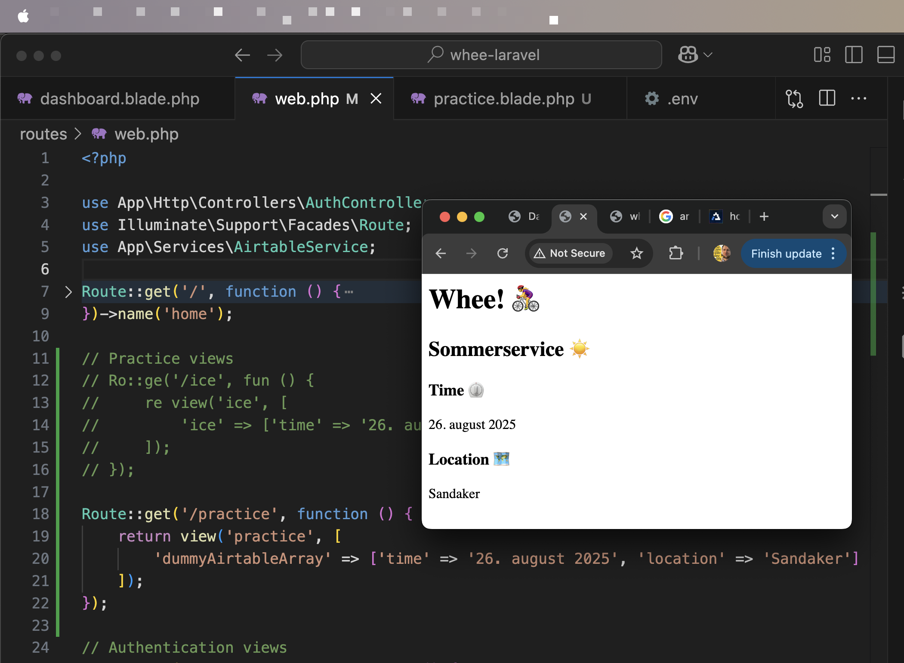

```php
// Practice $🤡 = ⛈️::🚴‍♀️(); 
// Rou::ge('/ice', fun () {
//     $🤡 = ⛈️::🚴‍♀️(); 
//     re view('ice', ['🤡' => $🤡]);
// });

Route::get('/newbike', function () {
    $dummyData = AirtableService::getNewBike();
    return view('practice', ['dummyData' => $dummyData]);
});
```





```php
// Practice Rou::ge();
// Rou::ge('/ice', fun () {
//     re view('ice', [
//         '🤡' => ['time' => '26. august 2025', 'location' => 'Sandaker']
//     ]);
// });

Route::get('/practice', function () {
    return view('practice', [
        'dummyAirtableArray' => ['time' => '26. august 2025', 'location' => 'Sandaker']
    ]);
});
```


```php
// web.php        
// Protected routes
// Ro::mleware('auth')->gro(fun () {

Route::middleware('auth')->group(function () {


    Route::get('/min-side', function () {
        $booking = AirtableService::getNextBooking();
        return view('dashboard', ['booking' => $booking]);
    })->name('dashboard');

    Route::get('/booking', function () {
        $booking = AirtableService::getNextBooking();
        return view('booking', ['booking' => $booking]);
    })->name('booking');
});


```


```php
// practice.blade.php  

<h1>Whee! 🚴‍♀️</h1>
<h2>Sommerservice ☀️</h2>
<h3>Time ⏲️</h3>
<p>{{ $dummyAirtableArray['time'] }}</p>
<h3>Location 🗺️</h3>
<p>{{ $dummyAirtableArray['location'] }}</p>

```