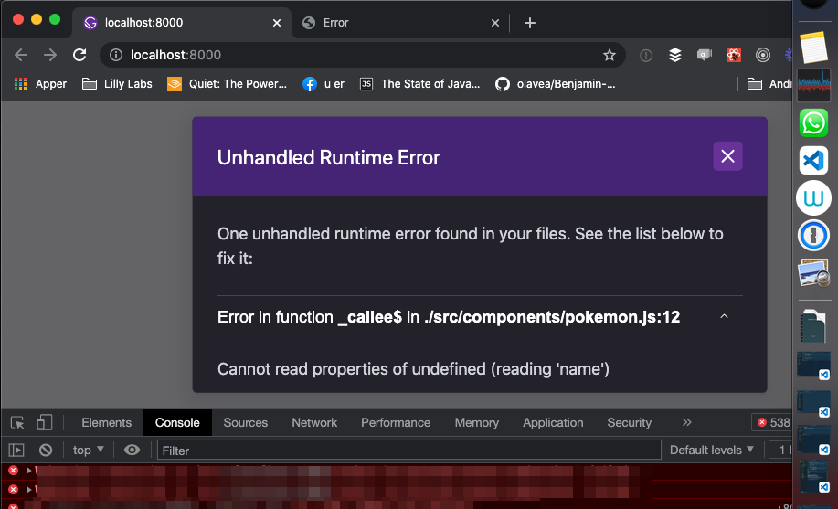

Subject:
Try

Ship Ahoy Skill Builder!

## One of my tiny tasks this week was:

– Try

I tried to

Did it work?

## One of your tiny tasks this week can be:

– Go click "thumps up" on \_ \_ \_ \_ _'s video and write an emoji comment. (My emoji comment is ⛵ 😺 👍 ). Because "thumps up" and comments are good for SEO. And we want _ \_ \_ \_ \_'s video to get views from other skill builders like us.

## What did I do?

**The Steps**

1. I opened my red notebook and found the four pages about « \_ \_ \_ \_ \_ \_ \_ \_ \_ \_ \_ \_ \_ \_ \_ \_ \_ \_ \_ _». 2. I did _ \_ \_ \_ \_
2. I \_ \_ \_ \_ \_ \_ \_ \_ \_ \_
3. I \_ \_ \_ \_ \_
4. I set my timer for 1 hour and 36 minutes and 33 seconds.
5. I \_ \_ \_ \_ \_
6. I \_ \_ \_ \_ \_
7. I repeated 6 and 7.
8. I \_ \_ \_ \_ \_
9. I \_ \_ \_ \_ \_ \_ \_ \_ \_ \_
10. I \_ \_ \_ \_ \_
11. I \_ \_ \_ \_ \_
12. I \_ \_ \_ \_ \_
13. I \_ \_ \_ \_ \_
14. I was done.

## Why did I do it?

## How did I do it?

😬 Feeling pain is temporary, skill building is FOREVER!

Try it for yourself 🔧😺👍.

Keep your skill-building-submarine afloat this week!
🔧⛵🏴‍☠️

Ola Vea
Gatsby Piraty Captain

P.S.

## One of your tiny tasks this week can be:

– Go click "thumps up" on \_ \_ \_ \_ _'s video and write an emoji comment. (My emoji comment is ⛵ 😺 👍 ). Because "thumps up" and comments are good for SEO. And we want _ \_ \_ \_ \_'s video to get views from other skill builders like us.

\_ \_ \_ \_ _'s video with his pokemon demo
[This is _ \_ \_ \_ _'s video with the time code _ \_ \_ \_ _, where she starts his _ \_ \_ \_ \_ demo](https://youtu.be/xPM7MhoaZY4?t=656)

Screenshot of \_ \_ \_ \_ \_'s video

<!--  -->

Screenshot of my \_ \_ \_ \_ _


### My code looked like this

```
// src / pages / index.js

    // hidden code
    // my code is on line 142

  _ _ _ _ _
    // hidden code


// src / components / pokemon.js
 _ _ _ _ _
```
