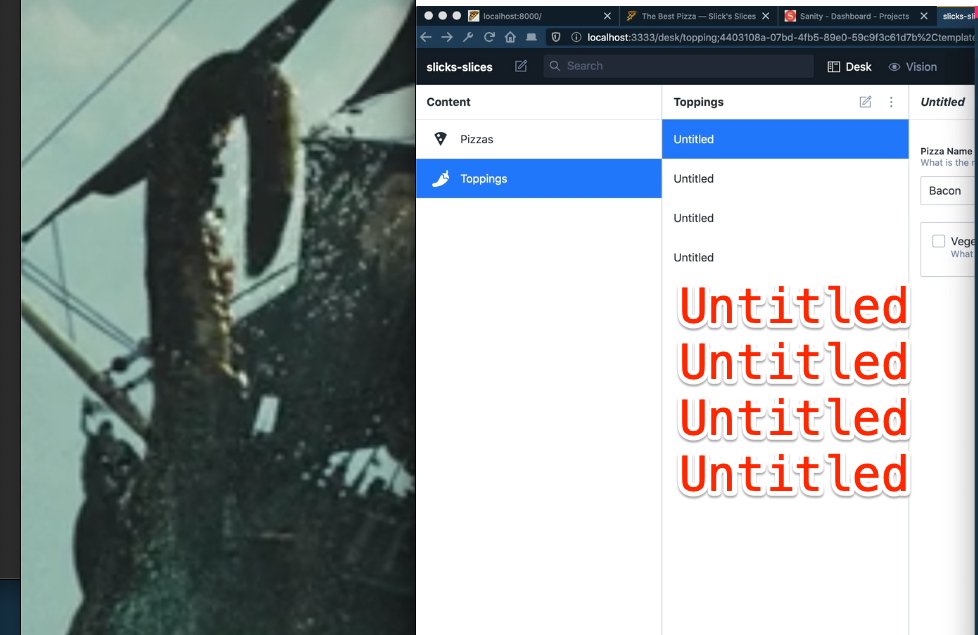

Subject:
I have a playful and piraty ship-mate Lillian (6 🏴‍☠️👸 )

Ship Ahoy Skill Building Pirate!

## One of my tiny tasks this week was:

– Try fixing the titles in custom preview in Sanity.

## What did I do?

I tried to get the pizza `titles` to show me something better than Untitled.

By fixing custom preview in Sanity.

## Why did I do it?

Later I will be showing photos of Lillian's projects and drawings, on my personal website. I don't know if she will LOVE that, but we'll see. Showing it to her is going to be fun for me at least. 😺🏴‍☠️

## How did I do it?

**The Steps**

1. I opened my Master Gatsby notebook and found page 12 with Preview Polly the pink parrot.
2. I opened my Sanity code in VS Code
3. I opened sanity / schemas / topping.js
4. I deleted the old preview code
5. I set my timer for 1 hour and 36 minutes and 33 seconds.
6. I re-coded step 1 while looking in my notebook. See P.S to look at my notes.
7. I ran this code

```js
//sanity / schemas / topping.js

export default {
  // Computer Name
  name: 'topping',
  // visible title
  title: 'Toppings',
  type: 'document',
  icon,
  fields: [...],
  preview: {
    select: {
      name: 'name',
    }
    // I need to write some code here to get a better title than Untitled
  },
};
```

8. And looked at http://localhost:3333/desk/topping



As you see my titles are all called Untitled, which is not what I want.

9. I re-coded step 2 while looking in my notebook. See P.S to look at my notes. The new code looked like this:

```js
//sanity / schemas / topping.js

export default {
  // Computer Name
  name: 'topping',
  // visible title
  title: 'Toppings',
  type: 'document',
  icon,
  fields: [...],
  preview: {
    select: {
      name: 'name',
    }
    prepare: ({name}) => ({
      title: `${name}`,
    }),
  },
};
```

10. I ran the code and looked at http://localhost:3333/desk/topping and I got the names of the toppings as titles. 💪😺🏴‍☠️

11. I repeated 6. -> 10.
12. I repeated 6. -> 10.
13. I repeated 6. -> 10.
14. I repeated 6. -> 10.
15. I was done.

My shipmate Lillian (6 🏴‍☠️ 👸 ) is useful for my skill building because she makes shipping my code playful and piratically fun.

Try finding a playful and piraty shipmate for yourself.
🔧😺👍

Keep your skill-building-submarine afloat this week!
🔧⛵🏴‍☠️

Ola Vea
Gatsby Piraty Captain

P.S.


## One of your tiny tasks this week can be:
