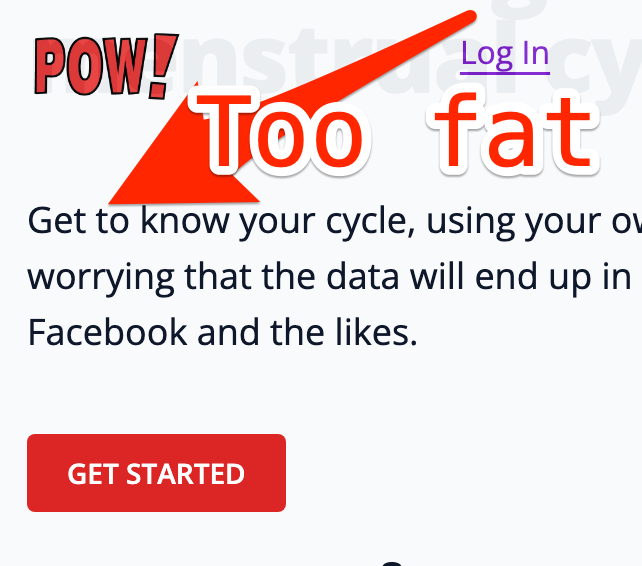

The other day QUEEN [@raae](https://x.com/raae) and I noticed The Pirate Princess (9) was tired

«I'm bored» Said the Pirate Princess:

«You wanna help me redesign our POW! website?» Captain Ola Said.

## Our redesigned POW! website


«YES! What does 'redesign' mean anyway?» Asked the lil' Pirate.

«A good question, I'll show ya! Let's play around with background colors in Tailwind.» Captain Ola Said.

«Ok. Let's GOOO!» The Pirate Princess 🏴‍☠️👸 said.

## Playing around with background colors in Tailwind

So I started out letting The Lil' Migrate Pirate (9) play around with the background colors on our POW! website. Using Tailwind classes. We sat at on our kitcheb table with my old laptop. She looked for "bg" in my Visual Studio Code. Then guessed the english spelling of "orange" and "yellow", which where the colors she most frequently chose.

The Pirate Princess (9) loved getting the background colors she wanted. Just like Captain Allister had suggested to me at the gym. She experimented with the shades using numbers.

## What Redesign Is

«So when are you going to tell me what redesign is?» The Pirate Princess (9) said.

«Redesign is changing how things look on the website.» Captain Ola Said.

«So redesign is what I just did?» Said the Pirate Princess.

## Now our POW! Website looks like this:


«How do you make that yellow go darker and darker like that?» Said The Pirate Princess 🏴‍☠️👸 (9).

«Just copy/paste THAT and chose your color like you're used to.» Dev Pirate Ola Said.

We now have this code in the header:

```js

<nav
  class="bg-gradient-to-b from-blue-400 to-green-400"
>
```



## Chris Sev 🥳🏴‍☠️

Hat tip to the talented and creative [Chris Sev](https://x.com/chris__sev) and his free and breathtakingly beautiful [Beginner Tailwind](https://youtu.be/wEM5NdJ-8HY?si=qQzTAIaOCqtZj-5T&t=5940) [FULL COURSE] on youtube. 9 hours of prime loot.

##

Notes for next part:
«.»

«.»

«.»
Dev Pirate Ola
Captain Ola Said The Pirate Princess 🏴‍☠️👸 (9) said.
