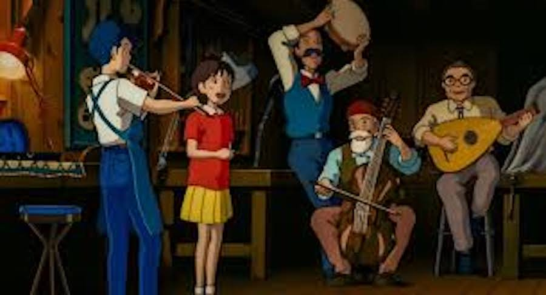
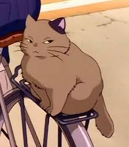

## What We Liked Best about Whisper of the Heart Movie

### Chonky Cat

### The antique shop owner's mustache

### Group performance of "Take Me Home, Country Roads". With Shizuku (14), Annoy-Boy, the shop owner and his two friends.

### Great vistas of Tokyo

## Worst about Whisper of the Heart

### All the boys look the same, except hair color. Same face, same clothes.

## Plot of Whisper of the Heart

Shizuku (14) reads a bunch of books.

One evening, Shizuku looks through the checkout cards in her library books and discovers they were all checked out previously by someone named Seiji Amasawa.

Over the next few days, she meets Annoy-Boy who annoys her by teasing her about her "Concrete Roads", lyrics.

Finding a Chonky Cat riding a train, Shizuku follows it to discover an antique shop run by Shirō. Shizuku is ecstatic about finding "a place where stories begin".

Returning to the antique shop again and again it is always closed. One day Chonky Cat sits outside the antique shop, Shizuku pets Chonky Cat.

Annoy-Boy shows up saying "I've never known Chonky Cat to let anybody pet him."

Annoy-Boy shows Shizuku the workshop, where she discovers that Annoy-Boy is learning to make violins to pursue his dream of becoming a master luthier. She begs him to play the violin for her, and he agrees, but on the condition that she sings along. The pair perform "Take Me Home, Country Roads". The shop owner and his two friends join in with their instruments.

Inspired by Annoy-Boy's dedication to learning to make violins, Shizuku starts writing a tall tale. With herself as the hero looking for her lost love and the Chonky Cat as the antagonist. Devoting her time to her writing and nothing else.

Okay I'll stop here or there will be spoilers.

## Trivia about Whisper of the Heart

Japanese title is "Mimi o Sumaseba", literally 'If You Listen Carefully'

Written by [Hayao Miyazaki](https://en.wikipedia.org/wiki/Hayao_Miyazaki) based on the [1989 manga Whisper of the Heart](https://m.manganelo.com/manga-ou95188) by [Aoi Hiiragi](https://en.wikipedia.org/wiki/Aoi_Hiiragi)

Read more on [wikipedia](https://en.wikipedia.org/wiki/Whisper_of_the_Heart)

If you go to the link below you should be able to listen to Country Roads in japanese:

[Take me home country roads (Whisper of the heart)](<https://en.wikipedia.org/wiki/File:Take_me_home_country_roads_(Whisper_of_the_heart).ogg>)

[I got a lot of these images from https://characterdesignreferences.com](https://characterdesignreferences.com/art-of-animation-8/art-of-whisper-of-the-heart)

